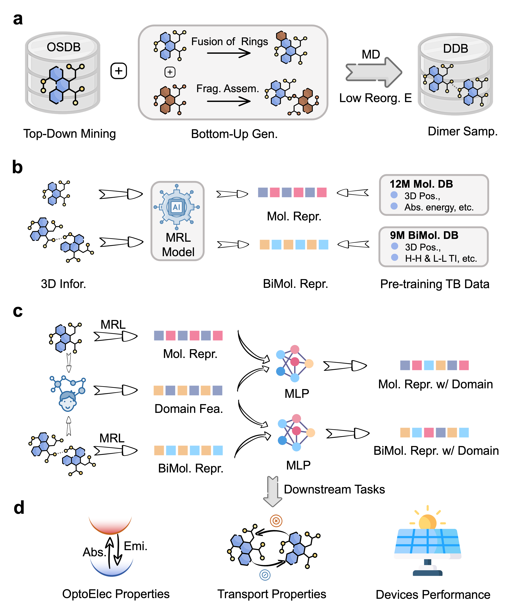

## Caracterización Virtual mediante Aprendizaje de Representaciones Mejorado con Conocimiento: desde Moléculas Conjugadas Orgánicas hasta Dispositivos (Aceptado en npj Computational Materials.)

[[Paper](https://chemrxiv.org/engage/api-gateway/chemrxiv/assets/orp/resource/item/67959d016dde43c9086a1f4b/original/oc-net-a-domain-knowledge-enhanced-general-moleculer-representation-framework-for-optoelectronic-and-charge-transport-materials.pdf)] Guojiang Zhao ,Qi Ou ,Zifeng Zhao ,Shangqian Chen ,Haitao Lin ,Xiaohong Ji ,Zhen Wang ,Hongshuai Wang ,Hengxing Cai ,Lirong Wu ,Shuqi Lu ,FengTianCi Yang ,Zhifeng Gao ,Zheng Cheng. 10.26434/chemrxiv-2025-b6n4m

La caracterización de las propiedades de los materiales desempeña un papel crucial para revelar la relación estructura-propiedad y optimizar el rendimiento de los dispositivos. Los materiales orgánicos optoelectrónicos y de transporte, ampliamente utilizados en diversos campos, enfrentan desafíos en la caracterización experimental de sus propiedades, no solo debido a su alto costo, sino también al requerimiento de conocimientos multidisciplinarios. Para abordar este problema, presentamos OCNet, un marco de aprendizaje de representaciones mejorado con conocimiento de dominio, con el cual es posible realizar una caracterización virtual eficiente y precisa. Basado en la arquitectura SE(3) transformer y en una base de datos de moléculas conjugadas a gran escala autoconstruida con millones de estructuras y propiedades, OCNet logra representaciones moleculares y bimoleculares generales y admite la integración de características de conocimiento de dominio. En múltiples tareas de predicción de propiedades optoelectrónicas, OCNet muestra una mejora significativa en la precisión en comparación con los modelos reportados previamente. También construye una base de datos de precisión DFT para los integrales de transferencia de materiales de película delgada y hace posible la predicción general de dichas propiedades. Con su interfaz intuitiva, OCNet puede servir como una herramienta de caracterización virtual eficaz, facilitando el desarrollo de dispositivos optoelectrónicos y otras investigaciones de materiales funcionales.

## Arquitectura General:

<p align="center">
  
  <br/>
  <br/>
</p>

## Dependencias

- [Uni-Core](https://github.com/dptech-corp/Uni-Core), consulte su [Documentación de Instalación](https://github.com/dptech-corp/Uni-Core#installation).
- rdkit==2024.3.1, instale mediante `pip install rdkit-pypi==2022.9.3`.
- xtb==6.7.1, instale mediante `conda install xtb==6.7.1`.
- Multiwfn, consulte su [Manual de Software](http://sobereva.com/multiwfn/misc/Multiwfn_3.7.pdf).

## Pre-entrenamiento

### Base de Datos de Pre-entrenamiento

#### 1. Descargar Base de Datos de Pre-entrenamiento Molecular

Descargue el conjunto de datos procesado `train.tar.gz` y `valid.lmdb` desde [Pre-training molecular database and models of OCNet](https://zenodo.org/records/14935486). Luego, descomprima `train.tar.gz` y copie `train.lmdb` y `valid.lmdb` al directorio `./molecular_properties/data/pretrain`.

#### 2. Descargar Base de Datos de Pre-entrenamiento Bimolecular

Descargue el conjunto de datos procesado `data.tar.gz` desde [Pre-training bimolecular database and models of OCNet](https://zenodo.org/records/14934728). Luego, copie `data/train.lmdb` y `data/valid.lmdb` al directorio `./biomolecular_properties/data/pretrain`.

### Pesos de Pre-entrenamiento

#### 1. Descargar Pesos de Pre-entrenamiento Molecular

Descargue el archivo de pesos `checkpoint_best.pt` desde [Pre-training molecular database and models of OCNet](https://zenodo.org/records/14935486). Luego copie `checkpoint_best.pt` a `molecular_properties/weight/pretrain`.

#### 2. Descargar Pesos de Pre-entrenamiento Bimolecular

Descargue el archivo de pesos `checkpoint_best.pt` desde [Pre-training bimolecular database and models of OCNet](https://zenodo.org/records/14934728). Luego copie `checkpoint_best.pt` a `bimolecular_properties/weight/pretrain`.

### Scripts y Estrategias de Pre-entrenamiento

Los scripts y estrategias de pre-entrenamiento se están actualizando progresivamente.

## Ajuste Fino (Fine-tuning)

### Ajuste Fino de Tareas Optoelectrónicas en Fase Gaseosa

#### 1. Descargue el conjunto de datos procesado desde [Downstream molecular models and properties of OCNet](https://zenodo.org/records/14931977). Luego, descomprima `gas_phase_data.tar.gz` y copie `gas_phase` a `./molecular_properties/data`.

#### 2. Si desea realizar el ajuste fino de cuatro propiedades optoelectrónicas, puede ejecutar el siguiente comando:

```
HOMO-LUMO GAP: cd ./molecular_properties/code/gas_phase_and_solution/gap_scripts && bash train.sh
s0-s1 energy: cd ./molecular_properties/code/gas_phase_and_solution/s0s1_scripts && bash train.sh
Electronic reorganization energy: cd ./molecular_properties/code/gas_phase_and_solution/er_scripts && bash train.sh
Hole reorganization energy: cd ./molecular_properties/code/gas_phase_and_solution/hr_scripts && bash train.sh
```

### Ajuste Fino de Tareas Optoelectrónicas en Solución

#### 1. Descargue el conjunto de datos procesado desde [Downstream molecular models and properties of OCNet](https://zenodo.org/records/14931977). Luego, descomprima `properties_in_solution_data.tar.gz` y copie `properties_in_solution` a `./molecular_properties/data`.

#### 2. Si desea realizar el ajuste fino de cuatro propiedades optoelectrónicas, puede ejecutar el siguiente comando:

```
Emission wavelength: cd ./molecular_properties/code/gas_phase_and_solution/emi_scripts && bash train.sh
Absorption wavelength: cd ./molecular_properties/code/gas_phase_and_solution/abs_scripts && bash train.sh
Full width at half maxima: cd ./molecular_properties/code/gas_phase_and_solution/fwhm_scripts && bash train.sh
Photoluminescence Quantum Yield: cd ./molecular_properties/code/gas_phase_and_solution/plqy_scripts && bash train.sh
```

### Ajuste Fino de Tareas Relacionadas con el Transporte

#### 1. Descargue el conjunto de datos procesado desde [Downstream bimolecular models and properties of OCNet](https://zenodo.org/records/14934618). Luego, descomprima `crystal_hh_data.tar.gz`, `crystal_ll_data.tar.gz`, `film_hh_data.tar.gz` y `film_ll_data.tar.gz`. Finalmente, copie `crystal_hh`, `crystal_ll`, `film_hh`, `film_ll` a `./bimolecular_properties/data`.

#### 2. Si desea realizar el ajuste fino de los integrales de transferencia en cristal o película delgada, puede ejecutar el siguiente comando:

```
Hole transfer integrals in crystal: cd ./biomolecular_properties/code/crystal_hh_scripts && bash train.sh
Electron transfer integrals in crystal: cd ./biomolecular_properties/code/crystal_ll_scripts && bash train.sh
Hole transfer integrals in film: cd ./biomolecular_properties/code/film_hh_scripts && bash train.sh
Electron transfer integrals in film: cd ./biomolecular_properties/code/film_ll_scripts && bash train.sh
```

## Inferencia

### Inferencia de Propiedades Optoelectrónicas en Fase Gaseosa

#### 1. Descargue el conjunto de datos procesado desde [Downstream molecular models and properties of OCNet](https://zenodo.org/records/14931977). Luego, descomprima `gas_phase_weight.tar.gz` y copie `gas_pahse` a `./molecular_properties/weight`.

#### 2. ejecute el siguiente comando para inferir las propiedades optoelectrónicas en la fase gaseosa:

```
HOMO-LUMO GAP: cd ./molecular_properties/code/gas_phase_and_solution/gap_scripts && bash infer.sh
s0-s1 energy: cd ./molecular_properties/code/gas_phase_and_solution/s0s1_scripts && bash infer.sh
Electronic reorganization energy: cd ./molecular_properties/code/gas_phase_and_solution/er_scripts && bash infer.sh
Hole reorganization energy: cd ./molecular_properties/code/gas_phase_and_solution/hr_scripts && bash infer.sh
```

### Inferencia de Propiedades Optoelectrónicas en Solución

#### 1. Descargue el conjunto de datos procesado desde [Downstream molecular models and properties of OCNet](https://zenodo.org/records/14931977). Luego, descomprima `properties_in_solutioin_weight.tar.gz` y copie `properties_in_solution` a `./molecular_properties/weight`.

#### 2. ejecute el siguiente comando para inferir las propiedades optoelectrónicas en la solución:

```
Emission wavelength: cd ./molecular_properties/code/gas_phase_and_solution/emi_scripts && bash infer.sh
Absorption wavelength: cd ./molecular_properties/code/gas_phase_and_solution/abs_scripts && bash infer.sh
Full width at half maxima: cd ./molecular_properties/code/gas_phase_and_solution/fwhm_scripts && bash infer.sh
Photoluminescence Quantum Yield: cd ./molecular_properties/code/gas_phase_and_solution/plqy_scripts && bash infer.sh
```

### Inferencia de Integrales de Transferencia

#### 1. Descargue el conjunto de datos procesado desde [Downstream bimolecular models and properties of OCNet](https://zenodo.org/records/14934618). Luego, descomprima `crystal_hh_weight.tar.gz`, `crystal_ll_weight.tar.gz`, `film_hh_weight.tar.gz` y `film_ll_weight.tar.gz`. Finalmente, copie `crystal_hh`, `crystal_ll`, `film_hh`, `film_ll` a `./bimolecular_properties/weight`.

#### 2. ejecute el siguiente comando para inferir los integrales de transferencia en cristales o películas:

```
Hole transfer integrals in crystal: cd ./biomolecular_properties/code/crystal_hh_scripts && bash infer.sh
Electron transfer integrals in crystal: cd ./biomolecular_properties/code/crystal_ll_scripts && bash infer.sh
Hole transfer integrals in film: cd ./biomolecular_properties/code/film_hh_scripts && bash infer.sh
Electron transfer integrals in film: cd ./biomolecular_properties/code/film_ll_scripts && bash infer.sh
```

### Inferencia de Movilidad Electrónica

#### 1. Descargue el conjunto de datos procesado desde [Thin film structures and transfer integrations](https://zenodo.org/records/15083880). Luego, descomprima `film_elec_mobility.zip`. Finalmente, copie `film_elec_mobility` a `./biomolecular_properties/data`.

#### 2. ejecute el siguiente comando para inferir los integrales de transferencia de cualquier película delgada (ej. mol_105511_mob):

```
cd ./biomolecular_properties/code/film_ll_scripts_elec
 && python lmdb_convert.py mol_105511_mob && bash infer.sh
```

#### 3. ejecute kMC para inferir la movilidad electrónica de cualquier película (ej. mol_105511_mob):

```
mobility calculated with the OCNet:cd ./biomolecular_properties/code/film_ll_scripts_elec
 && python mobility_film.py mol_105901_mob OCNet
mobility calculated with the QM method:cd ./biomolecular_properties/code/film_ll_scripts_elec
 && python mobility_film.py mol_105901_mob QM
mobility calculated with the xTB method:cd ./biomolecular_properties/code/film_ll_scripts_elec
 && python mobility_film.py mol_105901_mob xTB
```

### Inferencia de PCE del Dispositivo

#### 1. copie `valid.lmdb` a `./molecular_properties/data/pce`

#### 2. ejecute el siguiente comando para inferir el PCE del Dispositivo:

```
cd ./molecular_properties/code/gas_phase_and_solution/pce_scripts && bash infer.sh
```

## Licencia

Este proyecto está licenciado bajo los términos de la licencia MIT.


## Historial de Estrellas

[](https://www.star-history.com/#545487677/OCNet&Date)
