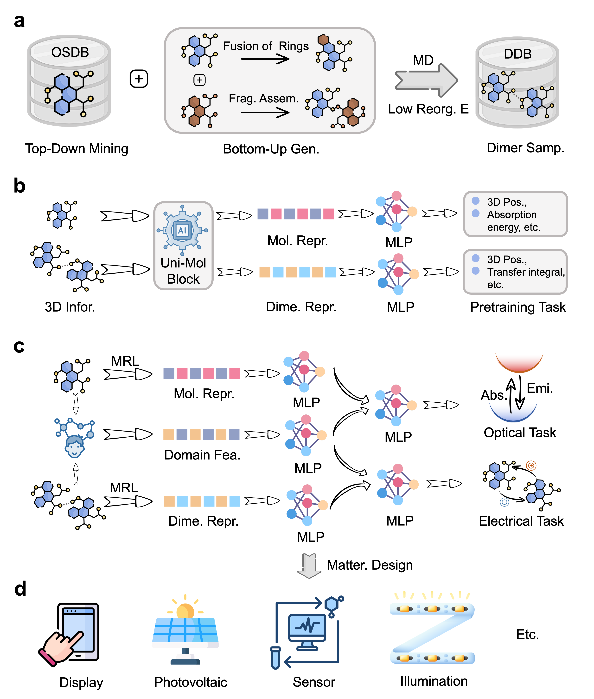

## Virtual Characterization via Knowledge-Enhanced Representation Learning: from Organic Conjugated Molecules to Devices

[[Paper](https://chemrxiv.org/engage/api-gateway/chemrxiv/assets/orp/resource/item/67959d016dde43c9086a1f4b/original/oc-net-a-domain-knowledge-enhanced-general-moleculer-representation-framework-for-optoelectronic-and-charge-transport-materials.pdf)] Guojiang Zhao ,Qi Ou ,Zifeng Zhao ,Shangqian Chen ,Haitao Lin ,Xiaohong Ji ,Zhen Wang ,Hongshuai Wang ,Hengxing Cai ,Lirong Wu ,Shuqi Lu ,FengTianCi Yang ,Zhifeng Gao ,Zheng Cheng. 10.26434/chemrxiv-2025-b6n4m

📢 Update: This work has been accepted in npj Computational Materials (2025).

The characterization of material properties plays a crucial role in revealing the structure-property relationship and optimizing device performance. Organic optoelectronic and transporting materials, widely used in various fields, face challenges in experimental property characterization not only due to their high cost but also the requirement of multidisciplinary knowledge. To address this problem, we introduce OCNet, a domain knowledge-enhanced representation learning framework, with which the efficient and accurate virtual characterization is made possible. Based on the SE(3) transformer architecture and a self-constructed large-scale conjugated molecular database with millions of structures and properties, OCNet realizes general molecular and bimolecular representation and supports the integration of domain knowledge features. In multiple optoelectronic property prediction tasks, OCNet shows a significant improvement in accuracy compared to previously reported models. It also constructs a DFT accuracy database for the transfer integrals of thin-film materials and renders the general prediction of such properties possible. With its user-friendly interface, OCNet can serve as an effective virtual characterization tool, facilitating the development of optoelectronic devices and other functional material research.

## Overall Architecture:

<p align="center">
  
  <br/>
  <br/>
</p>

## Dependencies

- [Uni-Core](https://github.com/dptech-corp/Uni-Core), check its [Installation Documentation](https://github.com/dptech-corp/Uni-Core#installation).
- rdkit==2024.3.1, install via `pip install rdkit-pypi==2022.9.3`.
- xtb==6.7.1, install via `conda install xtb==6.7.1`.
- Multiwfn, check its [Software Manual](http://sobereva.com/multiwfn/misc/Multiwfn_3.7.pdf).

## Pre-training

### Pre-training Database

#### 1. Download Molecular Pre-training Database

Download the processed dataset `train.tar.gz` and `valid.lmdb` from [Pre-training molecular database and models of OCNet](https://zenodo.org/records/14935486). Then, unzip `train.tar.gz` and copy the `train.lmdb` and `valid.lmdb` to `./molecular_properties/data/pretrain` directory.

#### 2. Download Bimolecular Pre-training Database

Download the processed dataset `data.tar.gz` from [Pre-training bimolecular database and models of OCNet](https://zenodo.org/records/14934728). Then, copy the `data/train.lmdb` and `data/valid.lmdb` to `./biomolecular_properties/data/pretrain` directory.

### Pre-training Weights

#### 1. Download Molecular Pre-training Weights

Download the weights file `checkpoint_best.pt` from [Pre-training molecular database and models of OCNet](https://zenodo.org/records/14935486). Then copy the `checkpoint_best.pt` to `molecular_properties/weight/pretrain`.

#### 2. Download Bimolecular Pre-training Weights

Download the weights file `checkpoint_best.pt` from [Pre-training bimolecular database and models of OCNet](https://zenodo.org/records/14934728). Then copy the `checkpoint_best.pt` to `bimolecular_properties/weight/pretrain`.

### Pre-training Scripts and Strategies

The pre-training scripts and strategies are updated in progress.

## Fine-tuning

### Fine-tuning Optoelectronic Task in Gas Phase

#### 1. Download the processed dataset from [Downstream molecular models and properties of OCNet](https://zenodo.org/records/14931977). Then, unzip the `gas_phase_data.tar.gz` and copy the `gas_phase` to `./molecular_properties/data`.

#### 2. If you want to fine-tuning four optoelectronic properties, you can run the following command:

```
HOMO-LUMO GAP: cd ./molecular_properties/code/gas_phase_and_solution/gap_scripts && bash train.sh
s0-s1 energy: cd ./molecular_properties/code/gas_phase_and_solution/s0s1_scripts && bash train.sh
Electronic reorganization energy: cd ./molecular_properties/code/gas_phase_and_solution/er_scripts && bash train.sh
Hole reorganization energy: cd ./molecular_properties/code/gas_phase_and_solution/hr_scripts && bash train.sh
```

### Fine-tuning Optoelectronic Task in Solution

#### 1. Download the processed dataset from [Downstream molecular models and properties of OCNet](https://zenodo.org/records/14931977). Then, unzip the `properties_in_solution_data.tar.gz` and copy the `properties_in_solution` to `./molecular_properties/data`.

#### 2. If you want to fine-tuning four optoelectronic properties, you can run the following command:

```
Emission wavelength: cd ./molecular_properties/code/gas_phase_and_solution/emi_scripts && bash train.sh
Absorption wavelength: cd ./molecular_properties/code/gas_phase_and_solution/abs_scripts && bash train.sh
Full width at half maxima: cd ./molecular_properties/code/gas_phase_and_solution/fwhm_scripts && bash train.sh
Photoluminescence Quantum Yield: cd ./molecular_properties/code/gas_phase_and_solution/plqy_scripts && bash train.sh
```

### Fine-tuning Transport-related Task

#### 1. Download the processed dataset from [Downstream bimolecular models and properties of OCNet](https://zenodo.org/records/14934618). Then, unzip the `crystal_hh_data.tar.gz`, `crystal_ll_data.tar.gz`, `film_hh_data.tar.gz`, and `film_ll_data.tar.gz`. Finally, copy the `crystal_hh`, `crystal_ll`, `film_hh`, `film_ll` to `./bimolecular_properties/data`.

#### 2. If you want to fine-tuning transfer integrals in crystal or thin film, you can run the following command:

```
Hole transfer integrals in crystal: cd ./biomolecular_properties/code/crystal_hh_scripts && bash train.sh
Electron transfer integrals in crystal: cd ./biomolecular_properties/code/crystal_ll_scripts && bash train.sh
Hole transfer integrals in film: cd ./biomolecular_properties/code/film_hh_scripts && bash train.sh
Electron transfer integrals in film: cd ./biomolecular_properties/code/film_ll_scripts && bash train.sh
```

## Infer

### Inferred Optoelectronic properties in Gas Phase

#### 1.Download the processed dataset from [Downstream molecular models and properties of OCNet](https://zenodo.org/records/14931977). Then, unzip the `gas_phase_weight.tar.gz` and copy `gas_pahse` to `./molecular_properties/weight`.

#### 2. run the following command to infer the optoelectronic properties in the gas phase:

```
HOMO-LUMO GAP: cd ./molecular_properties/code/gas_phase_and_solution/gap_scripts && bash infer.sh
s0-s1 energy: cd ./molecular_properties/code/gas_phase_and_solution/s0s1_scripts && bash infer.sh
Electronic reorganization energy: cd ./molecular_properties/code/gas_phase_and_solution/er_scripts && bash infer.sh
Hole reorganization energy: cd ./molecular_properties/code/gas_phase_and_solution/hr_scripts && bash infer.sh
```

### Inferred Optoelectronic properties in Solution

#### 1.Download the processed dataset from [Downstream molecular models and properties of OCNet](https://zenodo.org/records/14931977). Then, unzip the `properties_in_solutioin_weight.tar.gz` and copy `properties_in_solution` to `./molecular_properties/weight`.

#### 2. run the following command to infer the optoelectronic properties in the solution:

```
Emission wavelength: cd ./molecular_properties/code/gas_phase_and_solution/emi_scripts && bash infer.sh
Absorption wavelength: cd ./molecular_properties/code/gas_phase_and_solution/abs_scripts && bash infer.sh
Full width at half maxima: cd ./molecular_properties/code/gas_phase_and_solution/fwhm_scripts && bash infer.sh
Photoluminescence Quantum Yield: cd ./molecular_properties/code/gas_phase_and_solution/plqy_scripts && bash infer.sh
```

### Inferred Transfer Integrals

#### 1. Download the processed dataset from [Downstream bimolecular models and properties of OCNet](https://zenodo.org/records/14934618). Then, unzip the `crystal_hh_weight.tar.gz`, `crystal_ll_weight.tar.gz`, `film_hh_weight.tar.gz`, and `film_ll_weight.tar.gz`. Finally, copy the `crystal_hh`, `crystal_ll`, `film_hh`, `film_ll` to `./bimolecular_properties/weight`.

#### 2. run the following command to infer the transfer integrals in the crystals or films:

```
Hole transfer integrals in crystal: cd ./biomolecular_properties/code/crystal_hh_scripts && bash infer.sh
Electron transfer integrals in crystal: cd ./biomolecular_properties/code/crystal_ll_scripts && bash infer.sh
Hole transfer integrals in film: cd ./biomolecular_properties/code/film_hh_scripts && bash infer.sh
Electron transfer integrals in film: cd ./biomolecular_properties/code/film_ll_scripts && bash infer.sh
```

### Inferred Electron mobility

#### 1. Download the processed dataset from [Thin film structures and transfer integrations](https://zenodo.org/records/15083880). Then, unzip the `film_elec_mobility.zip`. Finally, copy the `film_elec_mobility` to `./biomolecular_properties/data`.

#### 2. run the following command to infer the transfer integrals of any thin film(e.g. mol_105511_mob):

```
cd ./biomolecular_properties/code/film_ll_scripts_elec
 && python lmdb_convert.py mol_105511_mob && bash infer.sh
```

#### 3. run kMC to infer the electron mobility of any film(e.g. mol_105511_mob

```
mobility calculated with the OCNet:cd ./biomolecular_properties/code/film_ll_scripts_elec
 && python mobility_film.py mol_105901_mob OCNet
mobility calculated with the QM method:cd ./biomolecular_properties/code/film_ll_scripts_elec
 && python mobility_film.py mol_105901_mob QM
mobility calculated with the xTB method:cd ./biomolecular_properties/code/film_ll_scripts_elec
 && python mobility_film.py mol_105901_mob xTB
```

### Inferred Device PCE

#### 1. copy the `valid.lmdb` to `./molecular_properties/data/pce`

#### 2. run the following command to infer the Device PCE:

```
cd ./molecular_properties/code/gas_phase_and_solution/pce_scripts && bash infer.sh
```

## Licence

This project is licensed under the terms of the MIT license.


## Star History

[](https://www.star-history.com/#545487677/OCNet&Date)
