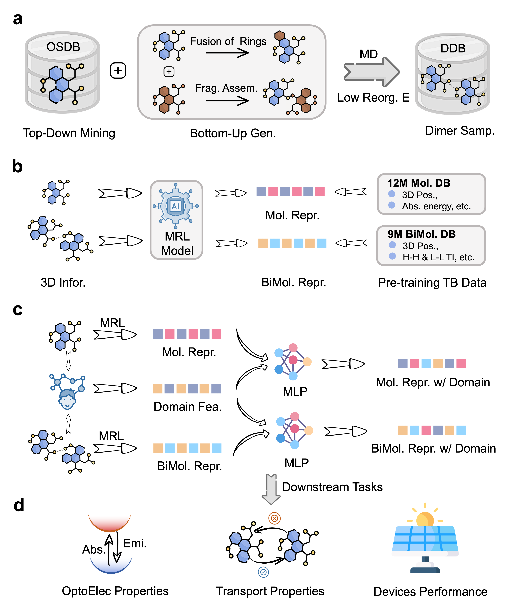

## OCNet: A Domain Knowledge-Enhanced General Moleculer Representation Framework for Optoelectronic and Charge-transport Materials
The characterization of material properties plays a crucial role in revealing the structure-property relationship and optimizing device performance. Organic optoelectronic and transporting materials, widely used in various fields, face challenges in experimental property characterization not only due to their high cost but also the requirement of multidisciplinary knowledge. To address this problem, we introduce OCNet, a domain knowledge-enhanced representation learning framework, with which the efficient and accurate virtual characterization is made possible. Based on the SE(3) transformer architecture and a self-constructed large-scale conjugated molecular database with millions of structures and properties, OCNet realizes general molecular and bimolecular representation and supports the integration of domain knowledge features. In multiple optoelectronic property prediction tasks, OCNet shows a significant improvement in accuracy compared to previously reported models. It also constructs a DFT accuracy database for the transfer integrals of thin-film materials and renders the general prediction of such properties possible. With its user-friendly interface, OCNet can serve as an effective virtual characterization tool, facilitating the development of optoelectronic devices and other functional material research.

## Overall Architecture:

  
   
   

